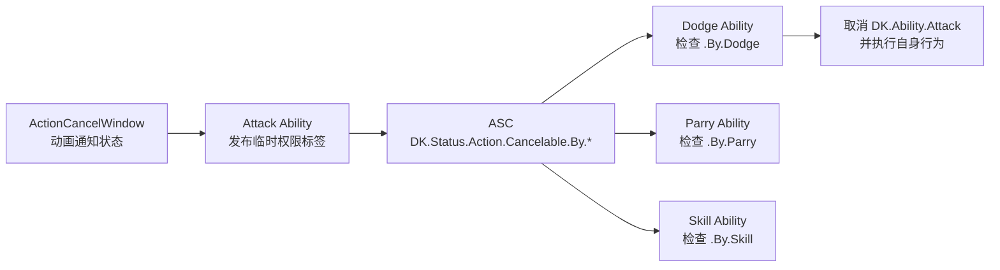

# 通用动作取消框架实现指导

> 适用项目：`First`（UE 5.6 / C++ / GAS）  
> 本文只提供实现指导，不会自动修改 C++、蓝图或动画资源。  
> 本方案取代此前仅服务于闪避的 `DodgeCancelable` / `DodgeCancelWindow` 方案。

---

## 1. 本次要解决的问题

角色的攻击后摇应该允许某些动作打断，例如：

- 闪避取消；
- 格挡取消；
- 技能取消；
- 未来可能的跳跃取消、武器切换取消等。

但“攻击动画第几帧可被打断”属于攻击动作本身；“某个行为能否启动、消耗什么资源、播放什么动画”则属于那个行为自己的 Ability。

因此，本方案采用**发布权限、消费权限**的结构：

```text
攻击蒙太奇 Notify State
    → 发送“动作取消窗口开/关”事件，并携带允许者标签
    → 当前攻击 Ability 将标签临时添加到 ASC
    → Dodge / Parry / Skill Ability 在 CanActivateAbility 中查询自身是否获准
    → 获准且成功提交资源后，由该 Ability 取消当前 Attack 类 Ability
```



这不是“攻击调用闪避”。攻击只说：**当前动作允许哪些类别取消**；闪避、格挡、技能各自决定是否执行。

---

## 2. 职责边界与低耦合原则

| 模块 | 负责内容 | 不负责内容 |
|---|---|---|
| `ANS_ActionCancel`（编辑器显示为 Action Cancel Window） | 在动画准确帧发送开/关事件；携带允许取消的标签 | 不播放闪避、不扣体力、不知道攻击类 |
| `FirstGA_DKLightAttack` | 接收事件，在 ASC 上添加或移除临时权限；被取消时清理攻击 | 不知道闪避蒙太奇、闪避方向、体力 |
| `FirstGA_DKDodge` | 判断是否允许闪避；提交体力；取消 Attack；播放 Dodge Montage | 不知道某一把剑的动画第几帧进入后摇 |
| ASC / GAS | 保存标签、激活 Ability、取消已激活 Ability | 不关心具体动画时间 |

本方案只保留两种必要的规则依赖：

```text
Dodge 知道：我能取消 “DK.Ability.Attack” 类行为。
Attack 知道：当前窗口允许 “By.Dodge / By.Parry / By.Skill” 中的哪些类别。
```

它们不互相引用 C++ 类，也不直接调用彼此的函数，因此属于标签驱动的低耦合设计。

---

## 3. 新增、修改、删除清单

### 3.1 新增

- 通用 Ability 父分类标签：`DK.Ability.Attack`
- 通用取消窗口事件：
  - `DK.Event.ActionCancelWindow.Open`
  - `DK.Event.ActionCancelWindow.Close`
- 通用取消权限标签：
  - `DK.Status.Action.Cancelable`
  - `DK.Status.Action.Cancelable.By.Dodge`
  - `DK.Status.Action.Cancelable.By.Parry`
  - `DK.Status.Action.Cancelable.By.Skill`
- 新 C++ Anim Notify State：`ANS_ActionCancel`
- 攻击 Ability 的通用取消权限标签管理。
- Dodge Ability 的条件激活与“取消 Attack 类 Ability”逻辑。

### 3.2 修改

- `FirstGA_DKLightAttack` 增加 `DK.Ability.Attack` Asset Tag。
- `FirstGA_DKDodge` 不再被 `DK.Status.Attacking` 无条件阻止。
- 攻击蒙太奇改为添加通用 `ActionCancelWindow`，并在编辑器中配置允许者标签。

### 3.3 删除（仅当你已经实现过旧的专用闪避方案）

若你已创建过以下内容，请删除它们，避免两套逻辑同时写入标签：

- `DK.Event.DodgeCancelWindow.Open`
- `DK.Event.DodgeCancelWindow.Close`
- `DK.Status.DodgeCancelable`
- `AnimNotifyState_DodgeCancelWindow.h/.cpp`
- `FirstGA_DKLightAttack` 中与 `bDodgeCancelWindowOpen`、`SetDodgeCancelWindowEnabled()` 有关的旧代码。

若尚未实现旧方案，这一节直接跳过。

---

## 4. 第一步：新增通用 Gameplay Tags

文件：`Source/First/Public/MyGameplayTags.h`

### 4.1 新增 Attack 父分类标签

在现有 Ability 身份标签区域中，**保留**原来的：

```cpp
FIRST_API UE_DECLARE_GAMEPLAY_TAG_EXTERN(DK_Ability_Attack_Light_Sword);
```

并在它前面新增：

```cpp
// 所有攻击 Ability 的通用分类标签。
// Dodge、Parry 等行为以后只需取消这个类别，而不依赖某一把武器的具体攻击类。
FIRST_API UE_DECLARE_GAMEPLAY_TAG_EXTERN(DK_Ability_Attack);
```

### 4.2 新增通用窗口事件标签

在 `DK_Event_ComboWindow_Open/Close` 下方新增：

```cpp
// 动作取消窗口是通用动画时间窗口，不专属于 Dodge。
// Notify 会把具体允许者标签放入 GameplayEventData.InstigatorTags。
FIRST_API UE_DECLARE_GAMEPLAY_TAG_EXTERN(DK_Event_ActionCancelWindow_Open);
FIRST_API UE_DECLARE_GAMEPLAY_TAG_EXTERN(DK_Event_ActionCancelWindow_Close);
```

### 4.3 新增通用取消权限状态标签

在状态标签区域新增：

```cpp
// 父标签：用于调试或以后查询“当前动作是否允许任意取消”。
FIRST_API UE_DECLARE_GAMEPLAY_TAG_EXTERN(DK_Status_Action_Cancelable);

// 子标签：具体哪些行为可取消当前动作。
FIRST_API UE_DECLARE_GAMEPLAY_TAG_EXTERN(DK_Status_Action_Cancelable_By_Dodge);
FIRST_API UE_DECLARE_GAMEPLAY_TAG_EXTERN(DK_Status_Action_Cancelable_By_Parry);
FIRST_API UE_DECLARE_GAMEPLAY_TAG_EXTERN(DK_Status_Action_Cancelable_By_Skill);
```

文件：`Source/First/Private/MyGameplayTags.cpp`

### 4.4 添加对应定义

在 Ability 标签定义区域新增：

```cpp
UE_DEFINE_GAMEPLAY_TAG(DK_Ability_Attack, "DK.Ability.Attack");
```

保留已有定义：

```cpp
UE_DEFINE_GAMEPLAY_TAG(
	DK_Ability_Attack_Light_Sword,
	"DK.Ability.Attack.Light.Sword");
```

在事件标签定义区域新增：

```cpp
UE_DEFINE_GAMEPLAY_TAG(
	DK_Event_ActionCancelWindow_Open,
	"DK.Event.ActionCancelWindow.Open");

UE_DEFINE_GAMEPLAY_TAG(
	DK_Event_ActionCancelWindow_Close,
	"DK.Event.ActionCancelWindow.Close");
```

在状态标签定义区域新增：

```cpp
UE_DEFINE_GAMEPLAY_TAG(
	DK_Status_Action_Cancelable,
	"DK.Status.Action.Cancelable");

UE_DEFINE_GAMEPLAY_TAG(
	DK_Status_Action_Cancelable_By_Dodge,
	"DK.Status.Action.Cancelable.By.Dodge");

UE_DEFINE_GAMEPLAY_TAG(
	DK_Status_Action_Cancelable_By_Parry,
	"DK.Status.Action.Cancelable.By.Parry");

UE_DEFINE_GAMEPLAY_TAG(
	DK_Status_Action_Cancelable_By_Skill,
	"DK.Status.Action.Cancelable.By.Skill");
```

### 4.5 标签层级说明

```text
DK.Status.Action.Cancelable
└── By
    ├── Dodge
    ├── Parry
    └── Skill
```

角色拥有 `DK.Status.Action.Cancelable.By.Dodge` 时，使用 `HasMatchingGameplayTag(DK.Status.Action.Cancelable)` 查询也会得到 true；但 Dodge 应始终查询最具体的 `.By.Dodge`，避免格挡窗口错误允许闪避。

完成本节后先编译一次。不要同时遗漏声明或定义。

---

## 5. 第二步：创建通用 ActionCancelWindow Notify State

### 5.1 创建 C++ 类

在 Unreal Editor 中：

1. 选择 **工具 → 新建 C++ 类**。
2. 勾选 **显示所有类**。
3. 搜索父类 `AnimNotifyState`。
4. 类名填写：`ANS_ActionCancel`。
5. 放入 `Notifies` 目录。

建议文件路径：

```text
Source/First/Public/Notifies/ANS_ActionCancel.h
Source/First/Private/Notifies/ANS_ActionCancel.cpp
```

### 5.2 新建头文件

这是新文件，可完整写入：

```cpp
#pragma once

#include "CoreMinimal.h"
#include "Animation/AnimNotifies/AnimNotifyState.h"
#include "GameplayTagContainer.h"
#include "ANS_ActionCancel.generated.h"

/**
 * 通用动作取消窗口。
 *
 * 在动画编辑器中，通过 GrantedCancelTags 决定当前窗口允许哪些行为取消：
 * 例如 Dodge、Parry、Skill。
 */
// UE 的 UCLASS 技术类名有长度限制，因此使用短名 ANS_ActionCancel。
// DisplayName 决定它在动画通知菜单中显示为 “Action Cancel Window”。
UCLASS(meta = (DisplayName = "Action Cancel Window"))
class FIRST_API UANS_ActionCancel : public UAnimNotifyState
{
	GENERATED_BODY()

public:
	// 在动画资产中配置。
	// 示例：只允许闪避时，添加 DK.Status.Action.Cancelable.By.Dodge。
	UPROPERTY(EditAnywhere, Category = "Action Cancel")
	FGameplayTagContainer GrantedCancelTags;

	virtual void NotifyBegin(
		USkeletalMeshComponent* MeshComp,
		UAnimSequenceBase* Animation,
		float TotalDuration,
		const FAnimNotifyEventReference& EventReference) override;

	virtual void NotifyEnd(
		USkeletalMeshComponent* MeshComp,
		UAnimSequenceBase* Animation,
		const FAnimNotifyEventReference& EventReference) override;
};
```

### 5.3 新建 CPP 文件

这是新文件，可完整写入：

```cpp
#include "Notifies/ANS_ActionCancel.h"

#include "Abilities/GameplayAbilityTypes.h"
#include "AbilitySystemBlueprintLibrary.h"
#include "MyGameplayTags.h"

namespace
{
	// 该函数只负责把动画时间点转换成 Gameplay Event。
	// 它不直接播放 Dodge，也不直接添加 ASC 标签。
	void SendActionCancelWindowEvent(
		USkeletalMeshComponent* MeshComp,
		const FGameplayTag& EventTag,
		const FGameplayTagContainer& GrantedCancelTags)
	{
		AActor* OwnerActor = MeshComp ? MeshComp->GetOwner() : nullptr;
		if (!OwnerActor || GrantedCancelTags.IsEmpty())
		{
			return;
		}

		FGameplayEventData EventData;
		EventData.Instigator = OwnerActor;
		EventData.Target = OwnerActor;

		// FGameplayEventData 没有专门名为 CancelTags 的字段。
		// 此项目约定：InstigatorTags 用来携带“本窗口授予哪些取消权限”。
		// 它不会自动写入 ASC，真正添加标签的是 Attack Ability。
		EventData.InstigatorTags = GrantedCancelTags;

		UAbilitySystemBlueprintLibrary::SendGameplayEventToActor(
			OwnerActor,
			EventTag,
			EventData);
	}
}

void UANS_ActionCancel::NotifyBegin(
	USkeletalMeshComponent* MeshComp,
	UAnimSequenceBase* Animation,
	float TotalDuration,
	const FAnimNotifyEventReference& EventReference)
{
	Super::NotifyBegin(MeshComp, Animation, TotalDuration, EventReference);

	SendActionCancelWindowEvent(
		MeshComp,
		MyGameplayTags::DK_Event_ActionCancelWindow_Open,
		GrantedCancelTags);
}

void UANS_ActionCancel::NotifyEnd(
	USkeletalMeshComponent* MeshComp,
	UAnimSequenceBase* Animation,
	const FAnimNotifyEventReference& EventReference)
{
	Super::NotifyEnd(MeshComp, Animation, EventReference);

	SendActionCancelWindowEvent(
		MeshComp,
		MyGameplayTags::DK_Event_ActionCancelWindow_Close,
		GrantedCancelTags);
}
```

### 5.4 为什么 Notify 不直接 AddLooseGameplayTag

虽然 Notify 可以直接取得 ASC 并添加标签，但不推荐这么做：

- Notify 不知道当前是哪一个 Ability 在拥有这个状态；
- 攻击被死亡、受击、卸载能力等方式结束时，Ability 的 `EndAbility()` 才是可靠清理点；
- 让 Notify 只发送事件，Ability 负责状态生命周期，更符合 GAS 的职责划分。

---

## 6. 第三步：将 LightAttack 改为通用权限发布者

文件：`Source/First/Public/AbilitySystem/Abilities/DK/FirstGA_DKLightAttack.h`

### 6.1 新增函数声明

在 `StartCurrentComboStep()` 下方新增：

```cpp
// 向 ASC 添加窗口授予的取消权限标签。
void AddActionCancelTags(const FGameplayTagContainer& TagsToAdd);

// 从 ASC 移除一个窗口结束时归还的取消权限标签。
void RemoveActionCancelTags(const FGameplayTagContainer& TagsToRemove);

// 攻击切段、正常结束或被打断时的最终安全清理。
void ClearActionCancelTags();
```

在已有的 ComboWindow 处理函数声明下方新增：

```cpp
UFUNCTION()
void HandleActionCancelWindowOpened(FGameplayEventData Payload);

UFUNCTION()
void HandleActionCancelWindowClosed(FGameplayEventData Payload);
```

### 6.2 新增标签引用计数容器

在临时连招状态变量区域新增：

```cpp
// 每种权限标签当前被多少个取消窗口持有。
// 使用计数而不是 bool，能避免未来两个窗口短暂重叠时提前移除标签。
TMap<FGameplayTag, int32> ActionCancelTagCounts;
```

### 6.3 CPP 新增 include

文件：`Source/First/Private/AbilitySystem/Abilities/DK/FirstGA_DKLightAttack.cpp`

在 include 区域新增：

```cpp
#include "AbilitySystem/FirstAbilitySystemComponent.h"
```

### 6.4 给轻攻击添加父分类，并明确允许被取消

在 `UFirstGA_DKLightAttack` 构造函数中，找到：

```cpp
AssetTags.AddTag(MyGameplayTags::DK_Ability_Attack_Light_Sword);
```

在它前面新增：

```cpp
// 所有攻击的通用类别，供 Dodge / Parry / Skill 取消整个 Attack 家族。
AssetTags.AddTag(MyGameplayTags::DK_Ability_Attack);
```

找到：

```cpp
InstancingPolicy = EGameplayAbilityInstancingPolicy::InstancedPerActor;
```

在下方新增：

```cpp
// 只有被标记为可取消的 Ability，其他 Ability 才能通过 ASC 取消它。
bIsCancelable = true;
```

### 6.5 监听通用取消窗口事件

在 `StartEventListeners()` 最后新增：

```cpp
UAbilityTask_WaitGameplayEvent* ActionCancelOpenTask =
	UAbilityTask_WaitGameplayEvent::WaitGameplayEvent(
		this,
		MyGameplayTags::DK_Event_ActionCancelWindow_Open,
		nullptr,
		false,
		true);

ActionCancelOpenTask->EventReceived.AddDynamic(
	this,
	&ThisClass::HandleActionCancelWindowOpened);

ActionCancelOpenTask->ReadyForActivation();

UAbilityTask_WaitGameplayEvent* ActionCancelCloseTask =
	UAbilityTask_WaitGameplayEvent::WaitGameplayEvent(
		this,
		MyGameplayTags::DK_Event_ActionCancelWindow_Close,
		nullptr,
		false,
		true);

ActionCancelCloseTask->EventReceived.AddDynamic(
	this,
	&ThisClass::HandleActionCancelWindowClosed);

ActionCancelCloseTask->ReadyForActivation();
```

### 6.6 新增三个通用标签管理函数

建议放在 `StartCurrentComboStep()` 后方：

```cpp
void UFirstGA_DKLightAttack::AddActionCancelTags(
	const FGameplayTagContainer& TagsToAdd)
{
	UFirstAbilitySystemComponent* ASC =
		GetFirstAbilitySystemComponentFromActorInfo();

	for (auto TagIt = TagsToAdd.CreateConstIterator(); TagIt; ++TagIt)
	{
		const FGameplayTag Tag = *TagIt;
		int32& Count = ActionCancelTagCounts.FindOrAdd(Tag);

		// 第一次获得该权限时才真正写入 ASC。
		if (Count == 0 && ASC)
		{
			ASC->AddLooseGameplayTag(Tag);
		}

		++Count;
	}
}

void UFirstGA_DKLightAttack::RemoveActionCancelTags(
	const FGameplayTagContainer& TagsToRemove)
{
	UFirstAbilitySystemComponent* ASC =
		GetFirstAbilitySystemComponentFromActorInfo();

	for (auto TagIt = TagsToRemove.CreateConstIterator(); TagIt; ++TagIt)
	{
		const FGameplayTag Tag = *TagIt;
		int32* Count = ActionCancelTagCounts.Find(Tag);
		if (!Count)
		{
			continue;
		}

		--(*Count);

		// 只有最后一个同类窗口关闭时，才真的移除 ASC 标签。
		if (*Count <= 0)
		{
			if (ASC)
			{
				ASC->RemoveLooseGameplayTag(Tag);
			}

			ActionCancelTagCounts.Remove(Tag);
		}
	}
}

void UFirstGA_DKLightAttack::ClearActionCancelTags()
{
	UFirstAbilitySystemComponent* ASC =
		GetFirstAbilitySystemComponentFromActorInfo();

	// 无论 Notify 是否正常收到 End，攻击结束时都保证归还所有权限。
	if (ASC)
	{
		for (const TPair<FGameplayTag, int32>& Pair : ActionCancelTagCounts)
		{
			ASC->RemoveLooseGameplayTag(Pair.Key);
		}
	}

	ActionCancelTagCounts.Empty();
}
```

### 6.7 新增事件处理函数

建议放在 ComboWindow 的两个处理函数后方：

```cpp
void UFirstGA_DKLightAttack::HandleActionCancelWindowOpened(
	FGameplayEventData Payload)
{
	if (!IsActive())
	{
		return;
	}

	AddActionCancelTags(Payload.InstigatorTags);
}

void UFirstGA_DKLightAttack::HandleActionCancelWindowClosed(
	FGameplayEventData Payload)
{
	RemoveActionCancelTags(Payload.InstigatorTags);
}
```

### 6.8 在攻击切段时清理上一段权限

在 `StartCurrentComboStep()` 中，验证当前 Montage 有效的 `if` 块之后、重置 Combo 状态之前新增：

```cpp
// Attack_1 → Attack_2 时，不允许上一段的取消窗口泄漏到下一段前摇。
ClearActionCancelTags();
```

### 6.9 在 EndAbility 中强制清理

在 `EndAbility()` 中、调用 `Super::EndAbility()` 之前新增：

```cpp
// 攻击正常结束、被 Dodge 取消、死亡打断时都会走到这里。
ClearActionCancelTags();
```

不要依赖 Notify 的 `NotifyEnd()` 作为唯一清理来源。

---

## 7. 第四步：让 Dodge 自己决定能否打断攻击

文件：`Source/First/Public/AbilitySystem/Abilities/DK/FirstGA_DKDodge.h`

### 7.1 新增 CanActivateAbility 声明

在 `ActivateAbility()` 声明之前新增：

```cpp
// 普通状态可闪避；攻击状态必须拥有 .By.Dodge 权限。
virtual bool CanActivateAbility(
	const FGameplayAbilitySpecHandle Handle,
	const FGameplayAbilityActorInfo* ActorInfo,
	const FGameplayTagContainer* SourceTags = nullptr,
	const FGameplayTagContainer* TargetTags = nullptr,
	FGameplayTagContainer* OptionalRelevantTags = nullptr) const override;
```

### 7.2 新增取消 Attack 家族的辅助函数声明

在 `private:` 区域新增：

```cpp
// 仅在 Dodge 已经成功 Commit 后取消当前 Attack 类 Ability。
void CancelActiveAttackAbilities();
```

文件：`Source/First/Private/AbilitySystem/Abilities/DK/FirstGA_DKDodge.cpp`

### 7.3 新增 include

在 include 区域新增：

```cpp
#include "AbilitySystem/FirstAbilitySystemComponent.h"
#include "AbilitySystemComponent.h"
```

### 7.4 删除无条件攻击阻止

在 Dodge 构造函数中删除：

```cpp
ActivationBlockedTags.AddTag(MyGameplayTags::DK_Status_Attacking);
```

保留以下原有规则：

```cpp
ActivationBlockedTags.AddTag(MyGameplayTags::DK_Status_Dodging);
ActivationBlockedTags.AddTag(MyGameplayTags::DK_Status_ChangingWeapon);
ActivationBlockedTags.AddTag(MyGameplayTags::Shared_Status_Dead);
```

### 7.5 新增 CanActivateAbility 实现

在 Dodge 构造函数结束后、`ActivateAbility()` 前新增：

```cpp
bool UFirstGA_DKDodge::CanActivateAbility(
	const FGameplayAbilitySpecHandle Handle,
	const FGameplayAbilityActorInfo* ActorInfo,
	const FGameplayTagContainer* SourceTags,
	const FGameplayTagContainer* TargetTags,
	FGameplayTagContainer* OptionalRelevantTags) const
{
	// 保留 GAS 的默认检查：死亡、已在闪避、切换武器、Cost、Cooldown 等。
	if (!Super::CanActivateAbility(
		Handle,
		ActorInfo,
		SourceTags,
		TargetTags,
		OptionalRelevantTags))
	{
		return false;
	}

	const UAbilitySystemComponent* ASC = ActorInfo
		? ActorInfo->AbilitySystemComponent.Get()
		: nullptr;

	if (!ASC)
	{
		return false;
	}

	const bool bIsAttacking = ASC->HasMatchingGameplayTag(
		MyGameplayTags::DK_Status_Attacking);

	// 不在攻击中时，Dodge 不需要任何取消权限。
	if (!bIsAttacking)
	{
		return true;
	}

	// 攻击中时，只接受动画窗口明确授予的 Dodge 权限。
	return ASC->HasMatchingGameplayTag(
		MyGameplayTags::DK_Status_Action_Cancelable_By_Dodge);
}
```

### 7.6 新增取消当前攻击的函数

在 `ActivateAbility()` 前新增：

```cpp
void UFirstGA_DKDodge::CancelActiveAttackAbilities()
{
	UFirstAbilitySystemComponent* ASC =
		GetFirstAbilitySystemComponentFromActorInfo();

	if (!ASC)
	{
		return;
	}

	FGameplayTagContainer AttackAbilityTags;
	AttackAbilityTags.AddTag(MyGameplayTags::DK_Ability_Attack);

	// nullptr：不额外排除标签。
	// this：不要取消当前正要启动的 Dodge Ability。
	ASC->CancelAbilities(&AttackAbilityTags, nullptr, this);
}
```

### 7.7 在 Dodge 成功 Commit 后取消攻击

在 `ActivateAbility()` 中，找到：

```cpp
if (!CommitAbility(Handle, ActorInfo, ActivationInfo))
{
	FinishDodge(true);
	return;
}
```

在这个 `if` 块之后新增：

```cpp
// 到这里说明闪避的 Cost / Cooldown 已经提交成功。
// 现在才取消攻击，避免体力不足时错误中断攻击。
CancelActiveAttackAbilities();
```

之后保留你原有的方向计算、LaunchCharacter 与 DodgeMontage 播放逻辑。

---

## 8. 第五步：配置攻击蒙太奇

对以下蒙太奇进行配置：

```text
AM_DK_Sword_Attack_1
AM_DK_Sword_Attack_2
AM_DK_Sword_Attack_3
AM_DK_Sword_Attack_4
```

### 8.1 添加 Notify State

1. 打开蒙太奇。
2. 在通知轨道右键。
3. 选择 **添加通知状态**。
4. 选择 **Action Cancel Window**。
5. 选中新建的状态通知，在详情面板找到 `Granted Cancel Tags`。

### 8.2 只允许闪避取消的常规后摇

在 `Granted Cancel Tags` 中添加：

```text
DK.Status.Action.Cancelable.By.Dodge
```

推荐时序：

```text
攻击前摇 → 命中 → ComboWindow → ComboWindow 结束
                                     ↓
                              ActionCancelWindow 开始
                                     ↓
                                后摇 / 收刀
                                     ↓
                              ActionCancelWindow 结束
                                     ↓
                                蒙太奇自然结束
```

建议让 `ActionCancelWindow` 的结束点位于蒙太奇最后 1～2 帧之前。

### 8.3 未来同时允许 Dodge 与 Parry

同一个 `ActionCancelWindow` 的 `Granted Cancel Tags` 可同时添加：

```text
DK.Status.Action.Cancelable.By.Dodge
DK.Status.Action.Cancelable.By.Parry
```

无需创建另一个通知类。Parry Ability 只要查询 `.By.Parry`，就能获得独立权限。

---

## 9. 运行时完整流程

以“攻击后摇中按闪避”为例：

```text
1. Attack Montage 进入 ActionCancelWindow Begin。
2. Notify 发送 DK.Event.ActionCancelWindow.Open，携带 .By.Dodge。
3. LightAttack Ability 收到事件，将 .By.Dodge 作为 Loose Tag 添加到 ASC。
4. 玩家按下闪避。
5. FirstGA_DKDodge::CanActivateAbility：
   - 有 Attacking；
   - 也有 .By.Dodge；
   - Cost 足够；
   - 因此允许激活。
6. Dodge Commit 成功。
7. Dodge 调用 CancelAbilities(DK.Ability.Attack)。
8. LightAttack 被取消：EndAbility 关闭武器碰撞、清理 Combo 与取消权限标签。
9. Dodge 继续执行自身方向、位移、Dodge Montage。
```

攻击前摇时不会出现第 3 步的权限标签，因此第 5 步会失败，攻击不会被打断。

---

## 10. 测试清单

| 测试 | 操作 | 预期结果 |
|---|---|---|
| 普通闪避 | 非攻击状态按闪避 | 正常闪避 |
| 前摇闪避 | 攻击刚开始按闪避 | 被拒绝，攻击继续 |
| 后摇闪避 | ActionCancelWindow 内按闪避 | 攻击停止，闪避开始 |
| 窗口外闪避 | 窗口结束后按闪避 | 被拒绝，攻击正常结束 |
| 连招后的权限清理 | Attack1 接入 Attack2，立刻在 Attack2 前摇按闪避 | 被拒绝，不能继承 Attack1 的窗口 |
| 最后一段 | Attack4 后摇窗口内按闪避 | Attack4 被取消，进入闪避 |
| 体力不足 | 后摇窗口内按闪避但体力不足 | 攻击不能被取消，角色不位移 |
| 闪避期间攻击 | Dodge 中按左键 | 被 `DK.Status.Dodging` 阻止 |
| 未来 Parry | 只配置 `.By.Dodge` 时按格挡 | 格挡不能取消攻击 |

---

## 11. 临时调试方法

若窗口内按闪避仍无效，可临时在 `CanActivateAbility()` 中、最终 return 前添加：

```cpp
UE_LOG(
	LogTemp,
	Warning,
	TEXT("[CancelTrace][Dodge] Attacking=%d | DodgeAllowed=%d"),
	bIsAttacking,
	ASC->HasMatchingGameplayTag(
		MyGameplayTags::DK_Status_Action_Cancelable_By_Dodge));
```

可在控制台输入：

```text
ShowDebug AbilitySystem
```

检查角色 ASC 是否在正确时间出现：

```text
DK.Status.Action.Cancelable.By.Dodge
```

验证完毕后删除临时 `UE_LOG`，避免输出日志被调试信息淹没。

---

## 12. 后续扩展示例

### 12.1 Parry Ability

Parry 的 `CanActivateAbility()` 采用同样模式：

```text
不在攻击中 → 可按自身规则激活。
在攻击中 → 必须拥有 DK.Status.Action.Cancelable.By.Parry。
```

Parry 成功 Commit 后同样取消 `DK.Ability.Attack`。

### 12.2 Skill Ability

技能可检查：

```text
DK.Status.Action.Cancelable.By.Skill
```

如果技能只允许在某些攻击后摇取消，就只在对应蒙太奇的 `Granted Cancel Tags` 中勾选 `.By.Skill`。

### 12.3 新武器与重攻击

新的重攻击 Ability 只需拥有：

```cpp
AssetTags.AddTag(MyGameplayTags::DK_Ability_Attack);
AssetTags.AddTag(MyGameplayTags::DK_Ability_Attack_Heavy_Sword);
```

它就自动进入“可被 Dodge / Parry / Skill 取消”的通用体系；不需要让 Dodge 认识重攻击的 C++ 类名。

---

## 13. 最终原则

```text
动画决定：什么时候允许取消。
当前动作 Ability 决定：如何发布、如何回收取消权限。
取消者 Ability 决定：自己能否启动、提交资源后取消谁、如何执行。
Gameplay Tags 决定：模块之间如何通信，而不是互相直接调用。
```

---

## 14. 编译错误与常见遗漏速查

### 14.1 `CanActivateAbility` 的最后一个参数不能带 `const`

基类的精确签名为：

```cpp
FGameplayTagContainer* OptionalRelevantTags = nullptr
```

不是：

```cpp
const FGameplayTagContainer* OptionalRelevantTags = nullptr
```

头文件声明和 CPP 定义都必须使用**没有 `const` 的指针**，否则会出现：

```text
error C3668: 使用 override 的方法没有重写任何基类方法
```

### 14.2 不要把基类 ASC 指针直接赋值给项目派生 ASC 指针

下面写法错误：

```cpp
UFirstAbilitySystemComponent* ASC = GetAbilitySystemComponentFromActorInfo();
```

`GetAbilitySystemComponentFromActorInfo()` 的返回类型是基类 `UAbilitySystemComponent*`。

在本项目的 Ability 中，应使用已经封装好的项目辅助函数：

```cpp
UFirstAbilitySystemComponent* ASC =
	GetFirstAbilitySystemComponentFromActorInfo();
```

它适用于：

```cpp
AddActionCancelTags()
RemoveActionCancelTags()
ClearActionCancelTags()
CancelActiveAttackAbilities()
```

若调用自定义 ASC 方法，CPP 还必须包含：

```cpp
#include "AbilitySystem/FirstAbilitySystemComponent.h"
```

### 14.3 每一个 WaitGameplayEvent Task 都必须 ReadyForActivation

Open Task 绑定回调后必须有：

```cpp
ActionCancelOpenTask->ReadyForActivation();
```

Close Task 也必须有：

```cpp
ActionCancelCloseTask->ReadyForActivation();
```

遗漏 Open Task 的 `ReadyForActivation()` 不一定产生编译错误，但它不会真正开始监听 Open 事件；结果就是取消窗口打开时 ASC 永远得不到 `.By.Dodge` 等权限标签。
